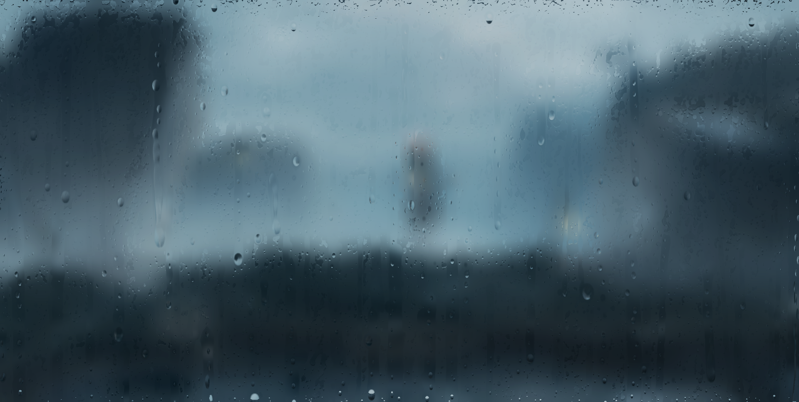

# Raindrop FX
Optimised raindrop effect on glass with WebGL2

Inspired by <https://github.com/codrops/RainEffect>

Check the live demo: <https://lab.sardinefish.com/rain>



Background image from <https://www.pixiv.net/artworks/84765992>

## Usage

### Use as npm package

You might need some bundle tools to run it in browser. eg. `esbuild` or `webpack`

```shell
$ npm install raindrop-fx
```

```javascript
const RaindropFX = require("raindrop-fx");

const canvas = document.querySelector("#canvas");
const rect = canvas.getBoundingClientRect();
canvas.width = rect.width;
canvas.height = rect.height;

const raindropFx = new RaindropFX({
    canvas: canvas,
    background: "path/to/background/image",
});

window.onresize = () =>
{
    const rect = canvas.getBoundingClientRect();
    raindropFx.resize(rect.width, rect.height);
}

raindropFx.start();
```


### In Browser
For directly use in browser, download the pre-bundled script at `/bundle/index.js` 
and embed with your Web page.
```html
<!DOCTYPE html>
<html lang="en">
<head>
    <title>Raindrop Effect</title>
    <link rel="stylesheet" href="assets/css/style.css">
    <script src="./bundle/index.js"></script>
</head>
<body>
    <div id="root">
        <canvas id="canvas"></canvas>
    </div>
    <script src="./script.js"></script>
</body>
</html>
```
`style.css`
```css
body {
    margin: 0;
}

#root {
    position: absolute;
    width: 100vw;
    height: 100vh;
}

#canvas {
    width: 100%;
    height: 100%;
}
```
`script.js`
```javascript

const canvas = document.querySelector("#canvas");

// Set canvas size to fit the real size
const rect = canvas.getBoundingClientRect();
canvas.width = rect.width;
canvas.height = rect.height;

const raindropFx = new RaindropFX({
    canvas: canvas,
    background: "path/to/backgroundImage",
});
raindropFx.start();

// Resize the effect renderer
window.onresize = () =>
{
    const rect = canvas.getBoundingClientRect();
    raindropFx.resize(rect.width, rect.height);
}

```


## Configuration

All options except canvas element are optional at initialize.

```javascript
// Minimal startup script with a dark opacity background
const raindropFx = new RaindropFX({
    canvas: canvas,
});
```

All options can be set dynamically by `raindropFx.options.xxx=xx` except renderer size and background image
Example: 
```javascript
// At initialize
const raindropFx = new RaindropFX({
    canvas: canvas,
    spawnSize = [30, 80],
    spawnInterval = [0.1, 0.2],
    mistBlurStep: 5,
    dropletsPerSecond: 1000,
});

await raindropFx.start();

// Or set directly
raindropFx.options.spawnSize = [30, 150];
raindropFx.options.spawnInterval = [0.01, 0.05];
raindropFx.options.mistBlurStep = 5;
raindropFx.options.dropletsPerSecond = 1000;
```

### Resize
Call `raindropFx.resize` to properly reszie.
```javascript
raindropFx.resize(someWidth, someHeight);
```

### Background
Background image must be set by calling to `raindropFx.setBackground`.

Background image source could be a url string, `HTMLCanvasElement`, `HTMLImageElement`, `ArrayBuffer` and other types that implemented interface `TexImageSource` and `ArrayBufferView`.
```javascript
await raindropFx.setBackground("background image url");

// Set background image from HTMLImageElement
const img = new Image();
// ... 
await raindropFx.setBackground(img);

// Set background image from another HTMLCanvasElement
const anotherCanvas = document.querySelector("#another-canvas");
await raindropFx.setBackground(anotherCanvas);
```

### Raindrop Simulation Options

```typescript
interface SimulationOptions
{
    spawnInterval: [number, number],
    /**
     * Random size range when spawn a new raindrop
     */
    spawnSize: [number, number],
    /**
     * Maximal amount of spawned raindrops.
     * Recommend less than 2000
     */
    spawnLimit: number,
    /**
     * Recommend in range (0..1), other value should be ok.
     */
    slipRate: number,
    /**
     * Describe how often a raindrop change its motion state
     */
    motionInterval: [number, number],
    /**
     * Random velocity x relative to velocity y. 
     * Recommend in range (0..0.1)
     */
    xShifting: [number, number],
    /**
     * Relative size for collision check. 
     * Recommend in range (0.6..1.2)
     */
    colliderSize: number,
    /**
     * Mass density of the slipping trail raindrop. 
     * Recommend in range (0.1..0.3)
     * 
     * A large value cause a raindrop quickly lose its size during slipping.
     */
    trailDropDensity: number,
    /**
     * Random size range of slipping trail drop. 
     * Recommend in range (0.3..0.5)
     */
    trailDropSize: [number, number],
    /**
     * Random distance range between two slipping trail drop. 
     * Recommend in range (20..40)
     */
    trailDistance: [number, number],
    /**
     * Vertical spread of a new spawned slipping trail drop. 
     * Recommend in range (0.4..0.6)
     */
    trailSpread: number,
    /**
     * Spread rate when a new spawned raindrop hit the screen. 
     * Recommend in range (0.4..0.7)
     */
    initialSpread: number,
    /**
     * Spread shrink rate per seconds. 
     * Recommend in range (0.01..0.02)
     */
    shrinkRate: number,
    /**
     * Spread rate by velocity Y. 
     * Recommend in range (0.2..0.4)
     * 
     * Raindrop with higher fall speed looks more narrow.
     */
    velocitySpread: number,
    /**
     * Mass lose per second. 
     * Recommend in range (10..30)
     */
    evaporate: number,
    /**
     * Gravity acceleration in pixels/s. 
     * Recommend 2400
     */
    gravity: number,
}
```

### Rendering Options
```typescript
interface RenderingOptions
{
    /**
     * Background blur steps used for background & raindrop refract image.
     * Value should be integer from 0 to log2(backgroundSize).
     * Recommend 3 or 4
     */
    backgroundBlurSteps: number,
    /**
     * Enable blurry mist effect
     */
    mist: boolean,
    /**
     * [r, g, b, a] mist color, each component in range (0..1). 
     * The alpha is used for whole mist layer.
     * Recommend [0.01, 0.01, 0.01, 1]
     */
    mistColor: [number, number, number, number],
    /**
     * Describe how long takes mist alpha from 0 to 1
     */
    mistTime: number,
    /**
     * Background blur steps used for mist.
     * Value should be integer from 0 to log2(backgroundSize).
     * Recommended value = backgroundBlurSteps + 1
     */
    mistBlurStep: number,
    /**
     * Tiny droplet spawn rate.
     */
    dropletsPerSeconds: number,
    /**
     * Random size range of tiny drplets.
     * Recommend [10, 30]
     */
    dropletSize: [number, number],
    /**
     * Smooth range [a, b] of raindrop edge.
     * Recommend [0.96, 1.0]
     * 
     * Larger range of (b - a) have smoother edge.
     * 
     * Lower value b makes raindrop larger with a distort edge
     */
    smoothRaindrop: [number, number],
    /**
     * Refract uv scale of minimal raindrop.
     * Recommend in range (0.2, 0.6)
     */
    refractBase: number,
    /**
     * Refract uv scaled by raindrop size.
     * Rocommend in range (0.4, 0.8)
     */
    refractScale: number,
    /**
     * Describe how raindrops are composed.
     * 
     * - `smoother` compose raindrops normal with 'exclusion' blend mode
     * 
     * - `harder` compose raindrops normal with 'normal' blend mode
     */
    raindropCompose: "smoother" | "harder"
    /**
     * Screen space (0..1) light direction or position.
     * Recommend [-1, 1, 2, 0]
     * 
     * - Use [x, y, z, 0] to indicate a direction
     * 
     * - Use [x, y, z, 1] to indicate a position
     */
    raindropLightPos: [number, number, number, number],
    /**
     * Lambertian diffuse lighting Color.
     * Recommend [0.3, 0.3, 0.3]
     */
    raindropDiffuseLight: [number, number, number],
    /**
     * Higher value makes more shadow.
     * Recommend in range (0.6..0.8)
     */
    raindropShadowOffset: number,
    /**
     * Similar to `smoothRaindrop`. Used to erase droplets & mist.
     * Recommended value [0.93, 1.0]
     */
    raindropEraserSize: [number, number],
    /**
     * Specular light clor.
     * Recommend disable it with [0, 0, 0] :)
     */
    raindropSpecularLight: [number, number, number],
    /**
     * Blinn-Phong exponent representing shininess.
     * Value from 0 to 1024 is ok
     */
    raindropSpecularShininess: number,
    /**
     * Will apply to calculate screen space normal for lighting.
     * Larger value makes raindrops looks more flat.
     * Recommend in range (0.3..1)
     */
    raindropLightBump: number,
}
```

## Performance
- On Windows Chrome 88. It takes about 6ms to update each frame with 2000 raindrops.

- On Android (Mi 10) Chrome 87. It takes about 6.5ms to update each frame with 2000 raindrops.

By default settins on a 1920x1080 screen, there are up to 600 raindrops on the screen, which taks 2~3ms to update each frame.
